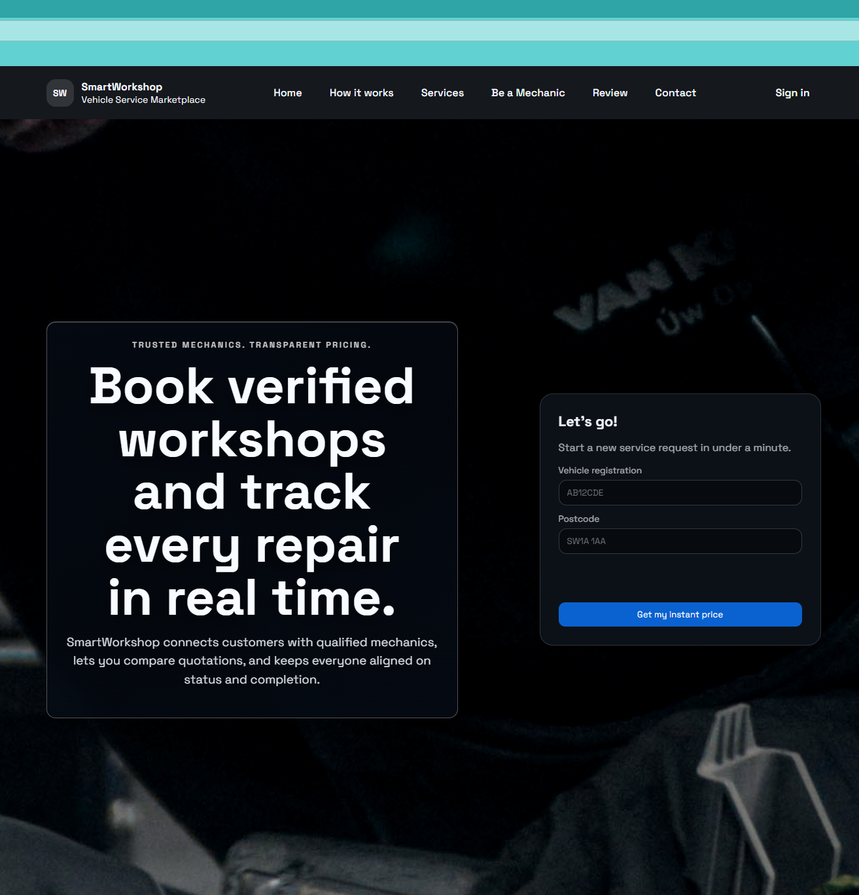

# SmartWorkshop – Smart Vehicle Service Marketplace L

SmartWorkshop is a final-year university project developed as a working prototype of a web-based vehicle service marketplace. The system connects customers, mechanics, and administrators through a role-based platform that supports vehicle service booking, mechanic onboarding, booking management, payments, invoices, and resolution case handling.

The application was developed using Node.js, Express, MySQL, Pug templates, Docker, and phpMyAdmin. It follows a modular monolithic architecture and was designed to demonstrate practical full-stack development, relational database design, authentication, role-based access control, and deployment preparation.

Directus is intentionally not used. The system uses a custom Express and MySQL implementation to keep the prototype lightweight and aligned with the project requirements.

---

## At a Glance

| Item | Value |
|---|---|
| Project | SmartWorkshop / Smart Vehicle Service Marketplace |
| Application type | Express UI + API |
| Local URL | `http://localhost:3000` |
| Health check | `http://localhost:3000/health` |
| API base | `http://localhost:3000/api` |
| Database | MySQL |
| Database admin | phpMyAdmin |
| Main stack | Docker Compose |
| Main user roles | Customer, Mechanic, Admin |

---

## Project Objectives

The main objectives of the project were to:

- design and implement a role-based vehicle service marketplace;
- allow customers to manage vehicles and request automotive services;
- support mechanic onboarding and service management workflows;
- provide an administrative interface for monitoring and governance;
- implement authentication, authorisation, and basic security controls;
- containerise the application for repeatable local and staging execution;
- validate the prototype through functional testing and staging smoke testing.

---

## Technology Stack

| Layer | Technology |
|---|---|
| Backend | Node.js, Express.js |
| Frontend | Pug templates, CSS, Vanilla JavaScript |
| Database | MySQL 8 |
| Authentication | JWT, bcrypt, optional 2FA |
| Containerisation | Docker, Docker Compose |
| Database Admin | phpMyAdmin |
| Email | SMTP / Nodemailer |
| Mapping / Location | Leaflet, Geoapify / OpenStreetMap fallback |
| Documentation | Markdown, OpenAPI scaffold |

---

## Core Functionality

SmartWorkshop provides three main user roles:

- **Customer:** register, log in, manage profile details, manage vehicles, create service bookings, view invoices, and manage resolution cases.
- **Mechanic:** complete onboarding, manage profile and service information, review assigned bookings, upload completion evidence, and respond to resolution cases.
- **Administrator:** monitor users, mechanic applications, bookings, payments, service catalogue items, contact messages, and resolution cases.

---

## Main Features

| Feature | Description |
|---|---|
| Multi-role access | Separate workflows for Customer, Mechanic, and Admin users |
| Booking workflow | Customer booking flow from vehicle selection to service confirmation |
| Mechanic dashboard | Mechanic onboarding, profile management, assigned bookings, and completion evidence |
| Admin workspace | Management of users, applications, bookings, payments, catalogue items, and resolution cases |
| Authentication | Login, registration, password hashing, JWT authentication, and optional 2FA |
| Resolution centre | Customer and mechanic communication for service-related issues |
| Database management | MySQL schema, seed data, phpMyAdmin access, and backup/restore scripts |
| Staging support | Separate staging stack, isolated database volume, and tunnel support |
| Demo support | Local Docker execution and optional Cloudflare Tunnel access for demonstrations |

---

## Screenshots

The following screenshots illustrate the main interfaces of the completed prototype.

> Replace the file paths below only if your screenshots use different names or locations.

| View | Screenshot path |
|---|---|
| Home Page | `docs/screenshots/home.png` |
| Customer Dashboard | `docs/screenshots/customer-dashboard.png` |
| Mechanic Dashboard | `docs/screenshots/mechanic-dashboard.png` |
| Admin Dashboard | `docs/screenshots/admin-dashboard.png` |
| Resolution Centre | `docs/screenshots/resolution-center.png` |

Example Markdown format for displaying a screenshot directly in GitHub:

```md

```

---

## Role Flow

```text
Customer
  └─ creates a service booking
      └─ mechanic reviews or manages the assigned booking
          └─ customer receives service updates and invoice information
              └─ resolution case can be opened if support is required
                  └─ admin monitors users, bookings, payments, and support cases
```

---

## System Architecture

SmartWorkshop is implemented as a modular Express and MySQL application. The backend, server-rendered views, static assets, and database integration are organised within one Dockerised project structure.

Key architectural decisions include:

- Express.js is used for routing, controllers, middleware, and API endpoints;
- Pug templates are used for server-rendered user interfaces;
- MySQL is used as the relational database;
- Docker Compose is used to run the application, database, and phpMyAdmin together;
- role-based access control is enforced through middleware;
- local and staging environments use separate configuration and database volumes.

---

## Repository Structure

```text
smartworkshop/
├── src/                 # Express backend, routes, controllers, services, middleware
├── views/               # Pug server-rendered templates
├── public/              # CSS, JavaScript, images, assets, and uploads
├── database/            # SQL schema, seed data, migrations, and backups
├── docs/                # Documentation, smoke tests, screenshots, OpenAPI files
├── scripts/             # Development, staging, backup, restore, and tunnel scripts
├── docker-compose.yml   # Local Docker stack
└── README.md            # Project documentation
```

---

## Requirements

| Requirement | Notes |
|---|---|
| Operating system | Windows 10/11 recommended |
| Docker | Docker Desktop with Docker Compose |
| Node.js | Version 18+ only required if running outside Docker |
| MySQL | Provided through Docker by default |
| Browser | Chrome, Edge, or another modern browser |

---

## Local Development Setup

### 1. Configure Environment Variables

Copy `.env.example` to `.env` in the repository root and update the values if required.

```powershell
copy .env.example .env
```

### 2. Start the Local Stack

From the repository root, run:

```bash
docker compose -f docker-compose.yml up --build -d
```

If you run the command from a subfolder, pass the environment file explicitly:

```bash
docker compose --env-file ../.env -f ../docker-compose.yml up --build -d
```

### 3. Open the Application

| Service | URL / Port |
|---|---|
| App | `http://localhost:3000` |
| Health check | `http://localhost:3000/health` |
| API base | `http://localhost:3000/api` |
| MySQL | `localhost:3306` |
| phpMyAdmin | `http://localhost:8081` |

---

## Development Scripts

| Script | Purpose |
|---|---|
| `./scripts/dev/start.ps1` | Start the local stack |
| `./scripts/dev/build.ps1` | Rebuild the local stack |
| `./scripts/dev/stop.ps1` | Stop the local stack |
| `./scripts/dev/recreate.ps1` | Recreate the local stack |
| `./scripts/dev/backup-db.ps1` | Back up the local database |
| `./scripts/dev/restore-db.ps1` | Restore the local database |
| `./scripts/dev/tunnel.ps1` | Open a Cloudflare Tunnel |

---

## Default Seed Accounts

The database is created automatically from `database/schema.sql`, and seed data is inserted when the application starts.

| Role | Email | Password |
|---|---|---|
| Admin | `admin@smartworkshop.local` | `Admin123!` |
| Mechanic | `mechanic@smartworkshop.local` | `Mechanic123!` |
| Customer | `customer@smartworkshop.local` | `Customer123!` |

> These accounts are intended for local development and demonstration purposes only.

---

## Database

The database schema is created automatically from:

```text
database/schema.sql
```

The local database runs through Docker using MySQL. phpMyAdmin is provided for database inspection and administration.

### phpMyAdmin Access

| Field | Value |
|---|---|
| URL | `http://localhost:8081` |
| Server | `db` inside Docker, or `localhost` from host |
| User | `DB_USER` in `.env` |
| Password | `DB_PASSWORD` in `.env` |

---

## Environment Validation

| Mode | Behaviour |
|---|---|
| Development | Placeholder values are allowed and only emit warnings |
| Staging | Strict validation is enforced |
| Any mode | Set `STRICT_ENV_VALIDATION=true` to force strict validation |

Additional environment rules:

- `TWO_FACTOR_REAUTH_HOURS` controls how long a successful login remains exempt from a new 2FA code. The default value is `24`.
- Admin accounts always require 2FA on login when 2FA is enabled.
- Customer and mechanic accounts use the reauthentication window defined above.
- `.env.staging` should use staging-specific values and should not rely on placeholder secrets.

---

## Temporary Demo Access with Cloudflare Tunnel

Cloudflare Tunnel can be used to expose the local or staging application temporarily during demonstrations. This is useful when the prototype needs to be accessed from another device or shared during a university presentation without deploying it as a permanent public production service.

### Local Tunnel

Start the application locally:

```powershell
./scripts/dev/start.ps1
```

Open the tunnel in a second terminal:

```powershell
./scripts/dev/tunnel.ps1
```

The tunnel points to the local application by default:

```text
http://localhost:3000
```

If public links and redirects should use the tunnel URL, update the following values in `.env` before starting the application:

```text
APP_BASE_URL
CORS_ORIGIN
```

If `cloudflared` is not installed, install it from the official Cloudflare documentation and add it to the system `PATH`.

---

## Staging Environment

The staging stack is used to validate the application before a demonstration or final cutover. It uses separate ports, configuration, and database volumes so that it remains isolated from local development.

### Start the Staging Stack

1. Copy `.env.staging.example` to `.env.staging`.
2. Set staging-specific values, including database credentials, SMTP credentials, and staging base URL.
3. Start the staging stack:

```powershell
./scripts/staging/stack-staging.ps1 start
```

### Staging Ports

| Service | URL / Port |
|---|---|
| App | `http://localhost:3001` |
| MySQL | `localhost:3307` |
| phpMyAdmin | `http://localhost:8082` |

### Staging Commands

| Script | Purpose |
|---|---|
| `./scripts/staging/rebuild-staging.ps1` | Rebuild staging |
| `./scripts/staging/reset-staging.ps1` | Reset staging from scratch |
| `./scripts/staging/start-staging-v1.ps1` | Start a specific saved volume |
| `./scripts/staging/start-staging-v2.ps1` | Start a specific saved volume |
| `./scripts/staging/start-staging-dev.ps1` | Start staging with nodemon |
| `./scripts/staging/backup-staging-db.ps1` | Back up staging database |
| `./scripts/staging/restore-staging-db.ps1` | Restore staging database |
| `./scripts/staging/migrate-staging-volume.ps1` | Move preserved data to a new volume |

### Staging Notes

- Staging uses its own MySQL volume and remains isolated from local development.
- The staging backend runs with `nodemon`, so changes in `src/`, `views/`, and `public/` reload after the stack restarts.
- The staging volume name can be overridden with `STAGING_DB_VOLUME`.
- The staging bootstrap can seed additional London mechanic test accounts for booking and search flows.

### Staging Tunnel

The staging tunnel exposes the staging stack instead of local development.

```powershell
npm run tunnel:staging:named
```

Default staging origin:

```text
http://localhost:3001
```

Suggested public staging URL:

```text
https://staging.smartworkshop.me
```

If a fixed staging hostname is used, start from:

```text
docs/cloudflared-staging.example.yml
```

After creating the tunnel and downloading the Cloudflare credentials, update:

```text
APP_BASE_URL
CORS_ORIGIN
```

To start both staging windows with one command, run:

```powershell
npm run staging:all
```

---

## Testing and Validation

Testing was carried out through manual functional testing, role-based workflow testing, and staging smoke testing. The main areas validated included:

- customer registration, login, vehicle management, and booking workflow;
- mechanic onboarding, dashboard access, profile management, and booking handling;
- admin monitoring of users, applications, bookings, payments, catalogue items, and resolution cases;
- authentication, role-based access control, and 2FA behaviour;
- email-related workflows where SMTP configuration was available;
- responsive interface checks across desktop, tablet, and mobile screen sizes.

Supporting test documentation is available in the `docs/` directory.

### Smoke Test Documentation

| Document | Path |
|---|---|
| Staging smoke test plan | `docs/staging-smoke-test-plan.md` |
| Staging smoke test report template | `docs/staging-smoke-test-report-template.md` |
| Text version of smoke test plan | `docs/staging-smoke-test-plan.txt` |
| Text version of smoke test report template | `docs/staging-smoke-test-report-template.txt` |

---

## Security Features

The prototype includes several security-focused features:

- password hashing using bcrypt;
- JWT-based authentication;
- role-based access control for Customer, Mechanic, and Admin users;
- protected routes and middleware checks;
- optional two-factor authentication;
- password reset workflow;
- email change verification workflow;
- environment-based configuration validation;
- separation between local and staging database volumes.

---

## API Access

The main API base is:

```text
http://localhost:3000/api
```

Example login request:

```bash
curl -X POST http://localhost:3000/api/auth/login \
  -H "Content-Type: application/json" \
  -d "{\"email\":\"customer@smartworkshop.local\",\"password\":\"Customer123!\"}"
```

Selected API areas include:

- authentication;
- customer booking workflows;
- mechanic workflows;
- admin management;
- payments and invoices;
- resolution cases;
- service catalogue management.

> API coverage may differ from the user interface because the prototype includes both server-rendered pages and JSON API routes.

---

## Demo Script

A Windows-friendly demo script is available:

```powershell
./scripts/demo.ps1
```

The script demonstrates a basic role-based flow using seeded demo users.

---

## Running Locally Without Docker

The recommended approach is Docker Compose. However, the application can also be run without Docker if MySQL is already installed and configured.

```bash
npm install
npm run dev
```

Make sure MySQL is running and `.env` points to the correct database connection.

---

## Reset Local Environment

To remove containers and volumes and recreate the local stack from scratch, run:

```bash
docker compose -f docker-compose.yml down -v
docker compose -f docker-compose.yml up --build -d
```

---

## Useful Commands

| Command | Purpose |
|---|---|
| `./scripts/dev/start.ps1` | Start local development stack |
| `./scripts/dev/build.ps1` | Rebuild local development stack |
| `./scripts/dev/stop.ps1` | Stop local development stack |
| `./scripts/dev/recreate.ps1` | Recreate local development stack |
| `npm run staging:all` | Start staging workflow, if configured |
| `npm run tunnel:fixed` | Run fixed local tunnel, if configured |
| `npm run tunnel:staging:named` | Run named staging tunnel, if configured |

---

## Known Limitations

As this project is a university prototype, some features are implemented for demonstration purposes rather than production use. Current limitations include:

- payment processing is simulated and does not use a live payment provider;
- some external integrations depend on environment configuration;
- staging access is intended for demonstration and testing, not public production use;
- the OpenAPI documentation is currently limited to selected endpoints;
- the system has not been deployed as a permanent public production service;
- additional automated test coverage would be required for production readiness.

---

## Future Work

Potential future improvements include:

- integration with a real payment provider;
- improved notification and email delivery monitoring;
- advanced mechanic availability scheduling;
- light and dark mode interface settings;
- improved API documentation coverage;
- automated test coverage for key workflows;
- production deployment with stronger monitoring, logging, and backup policies.

---

## Academic Context

SmartWorkshop was developed as a final-year Computer Science project. The prototype demonstrates the planning, design, implementation, testing, and evaluation of a practical full-stack web application. The project focuses on applying software engineering principles to a realistic service marketplace scenario involving multiple user roles, database-driven workflows, and operational validation through local and staging environments.

---

## Licence

This repository was developed for academic purposes. Add a formal licence file if the project will be made public beyond university submission or demonstration.
